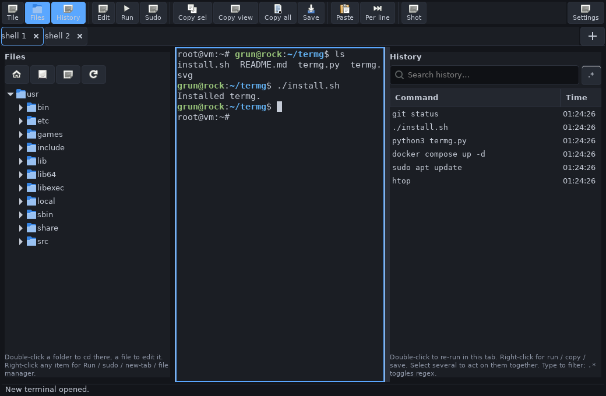

# termg

A real terminal emulator for Linux — **tabs *and* tiling** in one window, with a
searchable command-history journal, a resizable file-tree browser, and a script
runner. Built on GTK 3 + VTE 2.91 (the engine GNOME Terminal and Tilix use), so
every tab is a genuine PTY-backed shell.

[](https://github.com/johnphdavis-pixel/termg/actions/workflows/ci.yml)
&nbsp;
&nbsp;
&nbsp;



## Features

- **Tabs and tiling in one window**, with a tab switcher that stays visible in
  both modes — so even in a split you can click a tab to jump to that pane.
  Tiling stacks rows first, then columns.
- **Smart tabs** — auto-named from the working directory; double-click to
  rename, right-click to rename / pin / close. Pinned tabs hide their close button.
- **File-tree browser** (resizable) — double-click a folder to `cd` the active
  tab there, a file to edit it; right-click for Run, Run with sudo, Run in new
  tab, Run with sudo in new tab, Edit, Open in file manager, Copy path.
- **Command history** (resizable, searchable) — filter by substring or `.*`
  regex; double-click to re-run in the current tab, right-click to run in
  this/new tab, copy, or save (`.sh` with shebang + exec bit, or `.txt`).
- **Clickable URLs** — Ctrl+click links in the output to open them.
- **Clipboard history** — a panel that remembers what you've copied; double-click to copy it again (in-memory only, while the panel is open).
- **Find in scrollback** — Ctrl+Shift+F to search the terminal output.
- **Broadcast input** — in tiled view, mirror your typing to every pane
  (toolbar “Cast”), with an orange border on each pane while it's on.
- **Session restore** — reopens your tabs, working directories and layout on
  launch (optional, in Settings).
- **Copy / paste tools** — copy the selection, the visible screen, or the whole
  scrollback; paste normally or run the clipboard **one line per click**.
- **Passwords stay out of history** — only input typed at the shell prompt
  is recorded, so password prompts (sudo, ssh, su…) and full-screen apps
  (vim, less, htop) never leak into history. Optional redaction also masks
  secrets written inline on the command line.
- **Self-contained light/dark theme** that doesn't depend on your system GTK
  theme, plus per-window font zoom.
- **Screenshots** — built-in on X11, automatic external-tool fallback on
  Wayland, or your own command.

## Install

```bash
git clone https://github.com/johnphdavis-pixel/termg.git
cd termg
./install.sh        # installs for your user (menu entry + icon); no root
termg
```

`install.sh` installs into `~/.local`, adds a menu entry and icon, and removes
any previous install. Run it as your **normal user, not with sudo**. The command
is all lowercase: `termg`. If it isn't found, add `~/.local/bin` to your PATH:

```bash
echo 'export PATH="$HOME/.local/bin:$PATH"' >> ~/.bashrc && source ~/.bashrc
```

You can also just run it in place: `python3 termg.py`.

### Dependencies (it's cross-distro, not Mint-only)

termg is plain Python 3 + GTK 3 + VTE 2.91 via PyGObject — nothing is
Mint-specific. Install the bindings for your distro:

| Distro | Install |
| --- | --- |
| Debian / Ubuntu / Mint / Pop!_OS / elementary | `sudo apt install python3-gi gir1.2-gtk-3.0 gir1.2-vte-2.91` |
| Fedora | `sudo dnf install python3-gobject gtk3 vte291` |
| Arch / Manjaro / EndeavourOS | `sudo pacman -S python-gobject gtk3 vte3` |
| openSUSE | `sudo zypper install python3-gobject gtk3 typelib-1_0-Vte-2_91` |

## Usage

- **Tile / tab toggle** is top-left; the **＋ new-tab** button is at the end of
  the tab bar. Switch tabs with **Ctrl+Page Up/Down**, new tab **Ctrl+Shift+T**,
  close **Ctrl+Shift+W**. Zoom font with **Ctrl + / − / 0**.
- **Toolbar** (each button is labelled): Tile · Files · History ‖ Edit · Run ·
  Sudo ‖ Copy sel · Copy view · Copy all · Save ‖ Paste · Per line ‖ Shot, with
  Settings pinned on the right. Edit/Run/Sudo act on the file-tree selection, or
  ask you to pick a file.
- **Settings** (gear) holds the light/dark theme switch, your editor (default
  `nano`, with presets), the hidden-files toggle, and an optional custom
  screenshot command. Settings persist to `~/.config/termg/settings.json`.

## Distribution

A single self-contained file, so packaging is easy:

- **GitHub** (you're here) — add a release with the source zip.
- **.deb** for the Debian family — depends on `python3-gi`, `gir1.2-gtk-3.0`,
  `gir1.2-vte-2.91`.
- **AUR** (PKGBUILD) for Arch.
- **Flatpak / Flathub** — installs anywhere; a terminal needs the host-spawn
  permission (`flatpak-spawn --host`), so it's a little more involved.

## Two honest limitations

1. **Command history is reconstructed from your keystrokes** (it handles
   Backspace, Ctrl-U, Ctrl-C and escape sequences), so **Tab-completed** commands
   aren't captured perfectly. Typed and pasted commands record accurately.
2. **The built-in screenshot needs X11**; on Wayland it uses an external tool.

## Contributing

See [CONTRIBUTING.md](CONTRIBUTING.md). In short: it stays a single file with no
third-party Python dependencies, and the CI runs `py_compile` + `pyflakes` + a
headless import.

## Licence

[MIT](LICENSE). Created by Grun. Inspired by, but not connected to, Ginger Bill.
